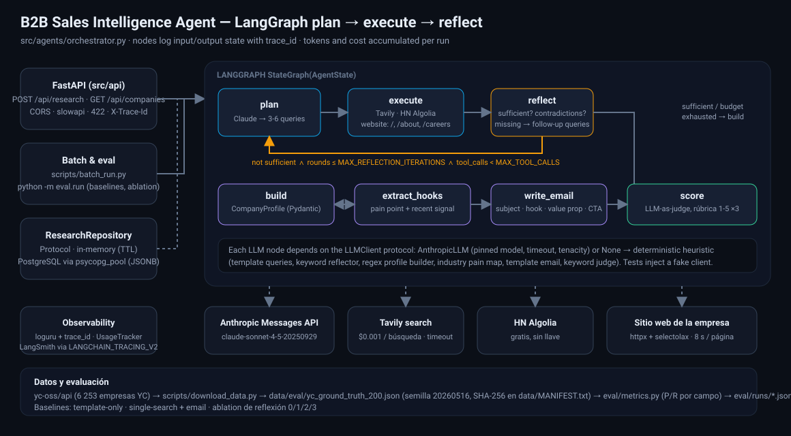
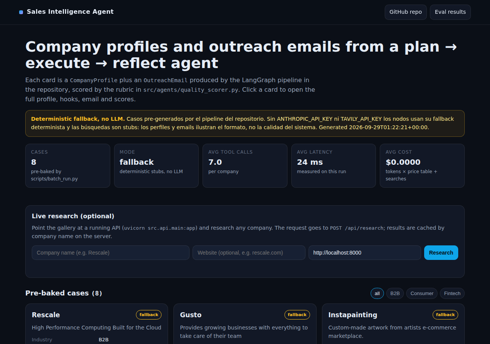
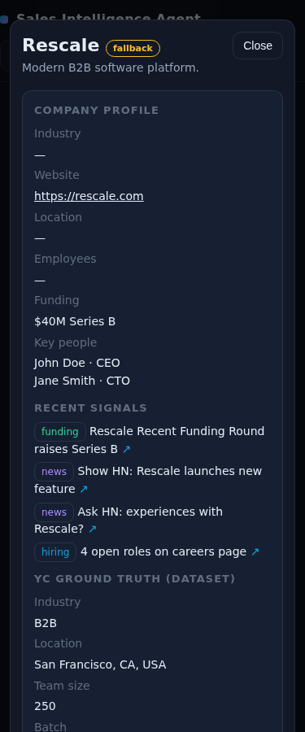

# B2B Sales Intelligence Agent

[](https://github.com/Juadsuarezsan/sales-intelligence-agent/actions/workflows/ci.yml)
[-brightgreen)](eval/RESULTS.md)
[](LICENSE)
[](https://juadsuarezsan.github.io/sales-intelligence-agent/demo/)
[](#limitaciones-conocidas)
[](pyproject.toml)

**Demo estática:** https://juadsuarezsan.github.io/sales-intelligence-agent/demo/ · **Resultados:** [`eval/RESULTS.md`](eval/RESULTS.md)

## Qué hace este proyecto

Le das el nombre de una empresa (y opcionalmente su sitio web) y el agente la investiga en la web pública, arma un perfil estructurado (qué hace, dónde está, cuánta gente tiene, financiación, personas clave, señales recientes) y escribe un email de contacto personalizado que un vendedor podría enviar tal cual. Un juez automático califica cada email por personalización, exactitud y claridad de la llamada a la acción.

## Caso de uso industrial

Es el motor detrás de productos de *sales intelligence* como Apollo.io, Clay.com u Outreach.io: equipos de SDR que tienen que contactar cientos de cuentas por semana y hoy dedican la mitad del tiempo a investigar cada una. Ejemplos concretos:

- Una startup SaaS que recibe una lista de 500 empresas de un evento y quiere priorizar y escribir el primer email a cada una en la misma tarde.
- Un equipo de partnerships de un banco que investiga fintechs recién financiadas para proponer integraciones.
- Una agencia de reclutamiento que detecta empresas con muchas vacantes abiertas (señal `hiring`) y escribe a su CTO.

## Arquitectura



Bucle **plan → execute → reflect** en LangGraph, seguido de **build → extract_hooks → write_email → score**. Cada nodo LLM usa Claude (`claude-sonnet-4-5-20250929`, ID fijado) a través de un `Protocol` y tiene un fallback determinista, así que el sistema completo corre sin llaves para tests, CI, demo y una corrida de evaluación offline. Detalles en [`docs/architecture.md`](docs/architecture.md).

| Componente | Archivo |
|---|---|
| Grafo, presupuestos y rutas | `src/agents/orchestrator.py` |
| Planner, reflector, profile builder, personalization extractor, email writer, quality scorer | `src/agents/*.py` |
| Cliente Anthropic (timeout, tenacity, tokens) | `src/llm.py` |
| Tavily, HackerNews Algolia, fetcher de sitio (httpx + selectolax) | `src/tools/*.py` |
| Repositorio (memoria / PostgreSQL con `psycopg_pool`) | `src/storage/repository.py` |
| API FastAPI (CORS, slowapi, 422, `X-Trace-Id`) | `src/api/main.py` |
| Eval: ground truth, métricas, baselines, ablation, reporte | `eval/` |

## Quickstart

```bash
git clone https://github.com/Juadsuarezsan/sales-intelligence-agent && cd sales-intelligence-agent
python3 -m venv .venv && .venv/bin/pip install -e ".[dev]"      # o: make install
.venv/bin/pytest -q --cov=src                                   # 105 tests, sin llaves
.venv/bin/python -m eval.run                                     # regenera eval/runs/*.json y eval/RESULTS.md
.venv/bin/uvicorn src.api.main:app --port 8000                   # API en http://localhost:8000/docs
```

Probar el API (con o sin llaves; sin llaves responde con `"mode": "fallback"`):

```bash
curl -s -X POST localhost:8000/api/research \
  -H 'Content-Type: application/json' \
  -d '{"company_name": "Rescale", "domain": "rescale.com"}' | python -m json.tool
```

Para usar Claude y Tavily copia `.env.example` a `.env` y rellena `ANTHROPIC_API_KEY` y `TAVILY_API_KEY`. Los demás pasos son idénticos. Otros comandos: `make data` (descarga el dataset y reconstruye el eval set), `make batch` (100 empresas), `make demo` (regenera `demo/predictions.json`), `make notebook`, `make lint`.

## Datos

- **Dataset:** directorio público de empresas de Y Combinator, espejo `yc-oss/api` — `https://raw.githubusercontent.com/yc-oss/api/main/companies/all.json` (6 253 empresas). Código del espejo bajo MIT; los datos son información pública de YC y aquí se usan sólo para evaluación.
- **Eval set:** 200 empresas activas con sitio, industria, sede, tamaño de equipo y one-liner, muestreadas con semilla `20260516` en `data/eval/yc_ground_truth_200.json`. El ground truth son los campos de YC tal cual (nada sintético). SHA-256 del crudo y del eval set en [`data/MANIFEST.txt`](data/MANIFEST.txt); esquema en [`docs/data_schema.md`](docs/data_schema.md).

## Métricas y resultados

Tabla de [`eval/RESULTS.md`](eval/RESULTS.md), corrida `eval/runs/2026-09-29-offline-stubs.json` sobre las 200 empresas. **Es una corrida sin llaves de API (fallback determinista, sin LLM, búsquedas stub): mide la mecánica del pipeline, no la calidad del sistema.** Las celdas `pendiente` se llenan ejecutando el mismo `python -m eval.run` con `ANTHROPIC_API_KEY` y `TAVILY_API_KEY`.

| Sistema | Accuracy (campos vs YC) | Personalization | Latencia | Costo/empresa |
|---|---|---|---|---|
| Template only | P 0,0 % / R 0,0 % (sin búsqueda; medido) | rúbrica heurística 2,00/5 (medido, sin LLM) | 0 ms (medido; sin I/O) | $0,0000 (medido) |
| Single-search + email | P 0,0 % / R 0,0 % (stubs; no representa al sistema) | pendiente (requiere ANTHROPIC_API_KEY); heurística 2,00/5 | pendiente (requiere ANTHROPIC_API_KEY + TAVILY_API_KEY) | pendiente (requiere ANTHROPIC_API_KEY + TAVILY_API_KEY) |
| Agent loop con reflection (este) | P 0,5 % / R 0,1 % (stubs; no representa al sistema) | pendiente (requiere ANTHROPIC_API_KEY); heurística 5,00/5 | pendiente (requiere ANTHROPIC_API_KEY + TAVILY_API_KEY) | pendiente (requiere ANTHROPIC_API_KEY + TAVILY_API_KEY) |

Lo que sí mide la corrida offline: el agente ejecuta **7 tool calls por empresa** (5 búsquedas, HN, sitio web) frente a 1 del single-search y 0 del template; con stubs el reflector heurístico declara suficiencia en la primera ronda, por lo que las filas del ablation (0/1/2/3 reflexiones) son idénticas y la curva costo-calidad queda pendiente. Accuracy = precisión/recall micro por campo (`industry`, `location`, `employees_est`, `one_liner`) con las reglas de `eval/metrics.py`; personalización = criterio 1 de la rúbrica numerada de `src/agents/quality_scorer.py`, que el reporte reproduce completa.

## Demo



`demo/index.html` carga `demo/predictions.json` (8 casos generados por `scripts/batch_run.py` con los stubs, declarado en la página), muestra cada `CompanyProfile` con su email y puntuaciones, y permite investigar en vivo contra un API en marcha (`POST /api/research`) con spinner y mensajes de error. Sin CDN, probado a 375 px.



## Decisiones técnicas

Resumen de [`docs/decisions.md`](docs/decisions.md):

1. **LangGraph `StateGraph`** y no `AgentExecutor`: las rutas (saltar la reflexión, re-planificar sólo con follow-ups y presupuesto) tienen que ser explícitas para el ablation; la validación de nombres de nodo detectó la colisión `email` que rompía el API.
2. **SDK oficial `anthropic` detrás de un `Protocol`** en vez de `langchain-anthropic`: tokens exactos para `cost_usd`, tipos de error para reintentar sólo transitorios, fake trivial en tests.
3. **Modelo fijado por ID datado** y `JUDGE_MODEL` separado: corridas comparables; el juez se cambia por variable.
4. **`httpx` + `selectolax`** para el sitio web: tres páginas estáticas por empresa, parseo en milisegundos; un navegador queda para los sitios 100 % JS.
5. **Fallback determinista por nodo** con etiquetado obligatorio (`mode`, `judge`): tests, demo y eval sin credenciales sin fingir resultados.
6. **Precisión/recall por campo contra YC** con reglas de match en código, y **rúbrica numerada** para el juez: métricas reproducibles, no "califica del 1 al 10".
7. **`psycopg_pool` + JSONB** sin ORM: una tabla, un upsert, sin migraciones al cambiar el esquema Pydantic.

## Observabilidad

`trace_id` por request (cabecera `X-Trace-Id`, en cada línea de log), tokens de entrada/salida, `cost_usd` (tokens × tabla de precios + $0.001 por búsqueda) y latencia por nodo en cada `ResearchResponse`. Con `LANGCHAIN_TRACING_V2=true` y `LANGCHAIN_API_KEY`, LangGraph envía las trazas a LangSmith y el cliente Anthropic se envuelve con su tracer. Galería pública de trazas: pendiente (requiere `LANGSMITH_API_KEY` + corrida real).

## Limitaciones conocidas

- **Sin números reales todavía.** No hay llaves configuradas: accuracy, personalización con juez, latencia y costo por empresa, curva del ablation y análisis de los diez peores casos ([`docs/error_analysis.md`](docs/error_analysis.md)) están pendientes. Todo lo publicado como medido viene de stubs y está etiquetado así.
- El fallback sin LLM no infiere industria ni headcount y toma el one-liner del meta description; con stubs, el perfil contiene datos enlatados (una "Series B" genérica, "John Doe") que no describen la empresa real.
- Las búsquedas de cada ronda y las tres páginas del sitio se descargan en serie; con Tavily real la latencia por empresa la domina esa cadena ([`docs/performance.md`](docs/performance.md)).
- Sitios renderizados 100 % con JavaScript devuelven poco texto al fetcher.
- Homónimos ("Meadow", "Docker") pueden mezclar evidencia de otras entidades; el filtro por dominio de la evidencia no está implementado.
- La cuota gratuita de Tavily (1 000 búsquedas/mes) no cubre el batch de 100 empresas más el eval de 200.
- `docker compose up` está escrito pero no validado (sin demonio Docker en el entorno de desarrollo); el despliegue público del API con p95 medido está pendiente.
- Sin trazas públicas en LangSmith ni releases/tags todavía.

## Trabajo futuro

1. Corrida real con llaves: `python -m eval.run` + `scripts/batch_run.py --limit 100`, publicar la tabla, la curva costo-calidad del ablation y 30 trazas públicas en LangSmith.
2. Búsquedas y fetch de páginas en paralelo dentro de cada ronda; prompt caching en los system prompts largos.
3. Caché de búsquedas por hash de consulta compartido entre eval, batch y API.
4. Filtro de evidencia por dominio y mapa de sinónimos industria → categorías YC para reducir FP.
5. Cola de trabajos (`202 Accepted` + workers) y Batch API para el procesamiento masivo.

## Estructura del repositorio

```
src/agents/      planner, reflector, profile_builder, personalization, email_writer, quality_scorer, orchestrator
src/tools/       web_search (Tavily/stub), hackernews, website (httpx + selectolax)
src/storage/     ResearchRepository: InMemoryRepository, PostgresRepository (psycopg_pool)
src/api/         FastAPI app y esquemas Pydantic
src/llm.py       LLMClient Protocol + AnthropicLLM · src/observability.py trace_id, UsageTracker, log_node
eval/            ground_truth, metrics, baselines, run (python -m eval.run), report → eval/RESULTS.md, eval/runs/
scripts/         download_data.py, batch_run.py, run_notebook.py
data/            eval/yc_ground_truth_200.json, MANIFEST.txt (raw/ y outputs/ ignorados)
demo/            index.html + predictions.json (GitHub Pages)
docs/            architecture, decisions, scalability, performance, error_analysis, data_schema, security, blog/
tests/           105 tests con mocks (respx, pytest-mock, httpx.MockTransport), fixtures HTML
```

## Autor

Juan David Suárez Sánchez · juadsuarezsan@unal.edu.co · https://www.linkedin.com/in/juan-david-suarez-sanchez-31ab281b7

Licencia MIT ([`LICENSE`](LICENSE)).
